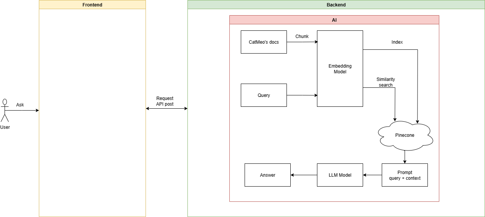
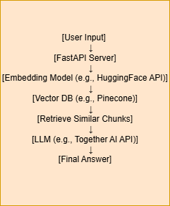

# 1. Topic: Smart Cat Litter Shop with AI Chatbot Support
An AI-powered e-commerce platform for purchasing cat litter, featuring a friendly chatbot that assists users in real time.

# 2. Indexing
## 2.1 Introduction
## 2.2 Feature
## 2.3 Architecture
## 2.4 Setup
## 2.5 Usage
## 2.6 Illustration
## 2.7 Limitation
## 2.8 Author

## 2.1. Introduction
- I have built Cat Litter Website integrated with a chatbot to keep in contact with customer when I am unavailable. The chatbot provides support, answers frequently asked questions, and helps users choose the right product for their cats. This solution aims to improve customer experience and automate basic support task.
## 2.2. Features
- User can chat with automate bot when I am unvailable.
- The chatbot can explain product details, answer frequently asked questions.
## 2.3 Architecture

## 2.4 Setup

### Create virtual environment
python -m venv venv

### Activate virtual environment
#### On Unix/macOS:
source venv/bin/activate

#### On Windows:
venv\Scripts\activate

### Installing requirement:
pip install -r requirement.txt
### Setup variablle environment:
- TOGETHER_API_KEY
- OPENROUTER_API_KEY
- HF_TOKEN
- Pinecone API
### Run the backend: 
uvicorn main:app

## Usage
- After run uvicorn main:app, it comes with http://127.0.0.1:8000 -> IP local. Then you add /docs after :8000 to test backend local -> http://127.0.0.1:8000/docs

## Illustration
- Flow application:
  
  

